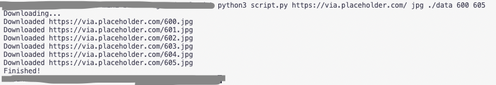

# Bulk Images Download

This tool downloads bunch of images by provided url and range.

## Requirements
- Python3 installed

## Running

`python3 script.py <url> <extension> <output_path> <from_range> <to_range>`

For example you want to download images in a rage from 'https://some-site.com/files/1.jpg' to 'https://some-site.com/files/10.jpg' into './data' folder. Then your command would look like this:

`python3 script.py https://some-site.com/files/ jpg ./data 1 10`

> **Note**
> The `output_path` directory should exist before the script run.

## Demo

`python3 script.py https://via.placeholder.com/ jpg ./data 600 605`

.